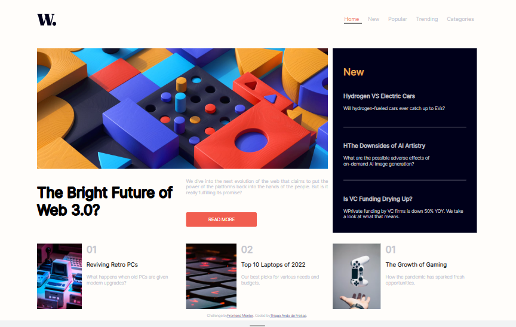
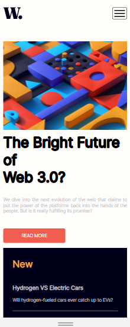
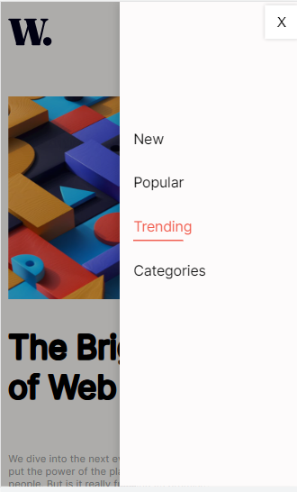

# Frontend Mentor - News homepage solution

This is a solution to the [News homepage challenge on Frontend Mentor](https://www.frontendmentor.io/challenges/news-homepage-H6SWTa1MFl). Frontend Mentor challenges help you improve your coding skills by building realistic projects. 

## Table of contents

- [Overview](#overview)
  - [The challenge](#the-challenge)
  - [Screenshot](#screenshot)
  - [Links](#links)
- [My process](#my-process)
  - [Built with](#built-with)
  - [What I learned](#what-i-learned)
  - [Continued development](#continued-development)
  - [Useful resources](#useful-resources)
- [Author](#author)
- [Acknowledgments](#acknowledgments)


## Overview

### The challenge

Users should be able to:

- View the optimal layout for the interface depending on their device's screen size
- See hover and focus states for all interactive elements on the page

### Screenshots
#### Main Pc

<p align="center">
    
</p>
</br>

#### Main Mobile

<p align="center">
    
</p>
</br>

#### Main Mobile Menu

<p align="center">
    
</p>


### Links

- Live Site URL: [thiagoando.github](  https://thiagoando.github.io/News-Homepage/)

## My process

### Built with

- Semantic HTML5 markup
- CSS custom properties
- Flexbox
- CSS Grid
- [Jquery]([https://reactjs.org/](https://jquery.com/)) - JS library


### What I learned

This challenge was very nice. I loved it. By completing this website, I was able to sharpen my CSS and JS skills. I played around with JS to apply a few animations to the page, like adding animation to the links within the page using Jquery. Of course, it would be easier to use HTML link tags to add the same effect. However, as I am learning Jquery, I thought it would be nice making it using Jquery code. I also add a slide menu on the mobile version of this page that I found very user-friendly. 

You can check the code used to make it below:

```html
    <nav class ="myNavy">
    <div class="oppacity"></div>
    <div class= "brand-title"></div>
  
    <div class="navbar-links display_none">
       <ul class="navbar-body"> 
        <li class="active mobVer"><a href="#" class="active">Home</a></li>
        <li><a href="#">New</a></li>
        <li><a href="#">Popular</a></li>
        <li><a href="#">Trending</a></li>
        <li><a href="#">Categories</a></li>
      </ul>
      <div class="tab-highlighter"></div>
    </div>
  
    <div class="menu-wrap smOnly">
      <div class="menu">
        <div class="icon-list">
          <a href="#"><span>New</span></a>
          <a href="#"><span>Popular</span></a>
          <a href="#"><span>Trending</span></a>
          <a href="#"><span>Categories</span></a>
        </div>
        <button class="close-button" id="close-button">X</button>
      </div>
    </div>
    
    <button class="smOnly menu-button fa fa-bars" id="open-button">
    </button>
  </nav>
```
```css
.menu-wrap {
    position: fixed;
    top: 0px;
    right: 0;
    z-index: 1001;
    width: 60%;
    height: 100%;
    padding: 40px;
    background-color: #fdfbfb;
    box-shadow: 0 0 15px rgba(0,0,0,0.2);
    -webkit-transition: all 0.5s cubic-bezier(0.7,0,0.3,1);
    -moz-transition: all 0.5s cubic-bezier(0.7,0,0.3,1);
    -ms-transition: all 0.5s cubic-bezier(0.7,0,0.3,1);
    -o-transition: all 0.5s cubic-bezier(0.7,0,0.3,1);
    transition: all 0.5s cubic-bezier(0.7,0,0.3,1);
    transition: all 0.5s cubic-bezier(0.7,0,0.3,1);
    transform: translate3d(360px,0,0);
  }

  .oppacity{
   position: fixed;
   left: 0;
   top: 0;
   width: 200px;
   height: 100vh;
   background-color: #00000052;
   transition: all .5s cubic-bezier(0.7,0,0.3,1);
   transform: translate3d(-200px,0,0);
  }

  .menu{
   position: absolute;
   left: 0;
   top: 170px;
   font-weight: 400;
  }

  .active {
    transform: translate3d(0,0,0);
  }

  
  .menu-wrap .menu .icon-list a {
    position: relative;
    display: block;
    padding: 20px;
    text-decoration: none;
    color: #050505;
    transition: all 0.3s ease;
    font-size: 1.3rem;
  }
  .menu-wrap .menu .icon-list a::before {
    position: absolute;
    content: "";
    width: 0%;
    height: 2px;
    top: 80%;
    transition: all 0.3s ease;
  }

  .menu-wrap .menu .icon-list a:hover::before {
    width: 50%;
    background-color: hsl(5, 85%, 63%);;
  }
  .menu-wrap .menu .icon-list a:hover {
    color:hsl(5, 85%, 63%);;
  }
  
  /* Buttons */
  .menu-button, 
  .close-button {
    position: fixed;
    top: 5px;
    width: 50px;
    height: 50px;
    background-color: #fff;
    font-size: 20px;
    border: none;
    outline: none;
    cursor: pointer;
    box-shadow: 0 0 5px rgba(0,0,0,0.2);
  }

  .menu-button {
    right: 0px;
    z-index: 102;
  }
  .close-button {
    top: 5px;
    right: 0px;
    z-index: 100;
  }
```
```js

var maxWidth = window.matchMedia("(max-width: 576px)");

function responsive(maxWidth) {
    if (maxWidth.matches) { 
      

      $(document).ready(function () {
        "use strict";
        var openBtn = $("#open-button"),
          colseBtn = $("#close-button"),
          menu = $(".menu-wrap"),
          oppacity = $(".oppacity");
          
        // Open menu when click on menu button
         openBtn.on("click", function () {
          menu.addClass("active");
          oppacity.addClass("active");
        });
        // Close menu when click on Close button
        colseBtn.on("click", function () {
          menu.removeClass("active");
          oppacity.removeClass("active");
        });
        // Close menu when click on anywhere on the document
        $(document).on("click", function (e) {
          var target = $(e.target);
          if (
            target.is(
              ".menu-wrap, .menu, .icon-list, .icon-list a, .icon-list a span, #open-button"
            ) === false
          ) {
            menu.removeClass("active");
            oppacity.removeClass("active");
            e.stopPropagation();
          }
        });

        $(".lgOnly").remove(".lgOnly");
        $(".menu-wrap").removeClass("smOnly");
        $("nav > .smOnly").removeClass("smOnly");
        $(".changeImg").attr("src", "image-web-3-mobile.jpg");
      });
}
```


### Continued development

Completing this project made me realize I need to improve my JS skills. This language is versatile and indispensable for building a good and functional user-friendly website. The next step is to use react library on my projects. 

### Useful resources

- [Bootstrap Navbar with Material Tabs and Search](https://codepen.io/TheThinkinGeek/pen/BLwVZy) - This code helped me to introduce animation to the navigation bar of the Pc version of the website . I really liked this pattern and will use it going forward.
- [Off canvas menu](https://codepen.io/ahmedbeheiry/pen/vxKmWw) - This code helped me to introduce animation to the navigation bar of the Mobile version of the website . I really liked this one as well.

## Author

- Website - [Thiago Ando de Freitas](https://thiagoando.github.io/Portfolio/)
- Frontend Mentor - [Thiago de Fritas](https://www.frontendmentor.io/profile/yourusername)


